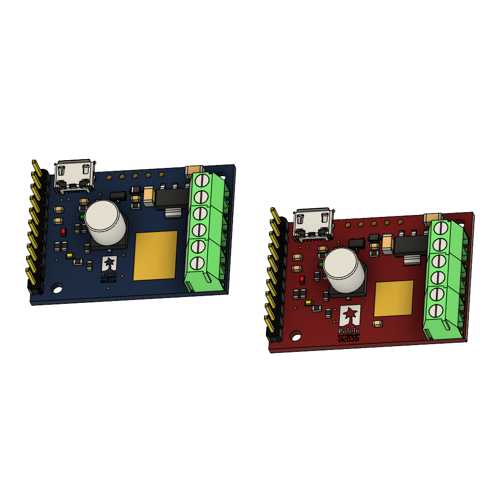

# PyTic2




## Getting started
`PyTic2` is a Python wrapper for the Pololu Tic Stepper Motor Controller series.
It is similar and inspired by the [PyTic](https://github.com/AllenInstitute/pytic) driver developed by the Allen Institute. The `PyTic2` driver is intended to be used on a Raspberry PI and uses the I2C interface for the communication with the Pololu Tic Stepper Motor Controllers. The API consists of the commands defined in the [Tic Stepper Motor Controller User’s Guide](https://www.pololu.com/docs/0J71)

The wrapper has been tested with Tic T825 and T500 motor controllers.

### Prerequisites

The communication with Pololu Stepper driver is done over the I2C interface and the smbus2 driver is required. The smbus2 driver can be pip installed.

  ```sh
  pip install smbus2
  ```
Please refer to the Section [15.8](https://www.pololu.com/docs/0J73/15.8) in the Pololu documentation for more detailed information 

### Installation
You can pip install the wrapper directly from github with the command if the setuptools package is installed:

```
pip install git+https://github.com/SRievers/pytic2
```

The wrapper library can otherwize be git cloned with the command:

```
git clone https://github.com/SRievers/pytic2
```

## Usage
Before the use of the wrapper, the Motor Controller control mode has to be set to Serial/I2C/USB and assigned an unique device number. This can be done with the `Pololu Control Center` that can be downloaded from the Pololu website.

The `pytic2` object can be instantiated after having imported the `pytic2` module. The Motor Controller commands are thereafter available as the object methods.  

### Python script example
```python
from smbus2 import SMBus
from pytic2 import pytic2

DEVICE_NUMBER = 20

bus = SMBus(3)
tic = pytic2(bus, DEVICE_NUMBER)

tic.setStepMode(3)            # = 2^-3 = 1/8
tic.setCurrentLimit(8)        # = 8*32 mA = 256 mA
tic.setMaxSpeed(4000000)
tic.setMaxAccel(40000)
tic.setMaxDecel(40000)

tic.haltAndSetPosition(0)
tic.energize()
tic.exitSafeStart()
tic.setTargetPosition(500)
tic.setTargetPosition(-500)
```

## License
[](./LICENSE)


